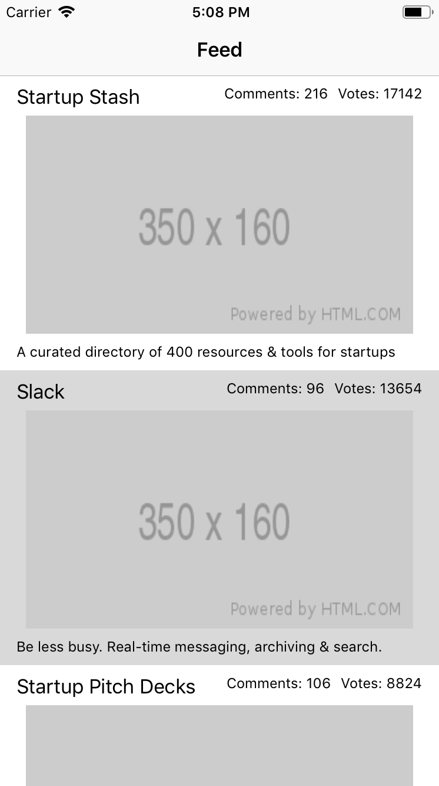

You just got hired to develop an app that shows the currently featured apps on [Product Hunt](https://producthunt.com) 🎉

The first feature the client wants you to implement is the feed, which displays all of today's featured products on Product Hunt. The goal for this tutorial is to build a **quick prototype** to show the client all the core features in action.

# Why is this important?

You'll want the app you're building to interact with APIs, or be able to communicate with them, then you need to know how to build a Network Layer, as well as how to code/decode data from APIs to your app and vice versa. This is common functionality that iOS engineers should expect to do in their careers, so learning the fundamentals around it now will make you that much more prepared for that upcoming gig.

# Learning Outcomes

By the end of this tutorial, you should be able to:

1. Work with APIs interacting with an iOS app.
1. Build a Network Layer in Swift.
1. Decode JSON into Swift models.
1. Take advantage of mock data.
1. Display data in tableviews with custom UI.

# Technical Planning

Here's what we need to do to get this feed up and running:

1. Inspect the Product Hunt API
1. Build the Feed View
1. Create the Post Model
1. Build the Post Cell
1. Create the Post Cell Class
1. Test the Feed Table View
1. Allow the Post Model to work with network requests
1. Create the network layer
1. Retrieve data from the PH API
1. Build the Comments View
1. Pull Comments data from the API
1. Update the view controllers to hook everything up

# What We're Building

Here's what the prototype app will look like:

## User Stories

**As a user...**

- I can browse products featured today on Product Hunt by scrolling through the app's main screen.
- I see each product's name, tagline, number of votes.
- I can tap on each post to see its comments in descending order.

# Implementation Plan

We're going to start with the UI of the app and then moving on to the networking layer.

This makes it quick and easy to build out the app and test some of its features before making requests to the API.

# Using Git/GitHub

As you go through this tutorial, you will also be making commits after completing milestones. **This is a requirement, you must make a commit whenever the tutorial prompts you**. This not only further enforces best practices for software engineering, but also will help you more easily figure out where a bug originated from if you break your progress up into discrete, trackable chunks.

When prompted to commit, you'll see a sample commit message. Feel free to use your own message, so long as it clearly and concisely covers the work done.

Lastly, the commit prompts in this tutorial should be the **minimum** amount of times you commit. If you want to do more commits, breaking your chunks into even smaller chunks, that is totally fine!
