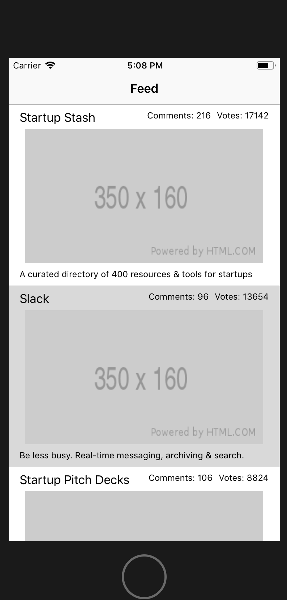

Imagine that you're a developer who is hired to create a Product Hunt reader that shows the currently featured apps on Product Hunt.

The first feature the client wants you to implement is the feed, which displays all of today's featured products on the Product Hunt. Build a quick prototype to shows the client all the core features in action.

# What We're Building

## User Stories

**As a user...**

- I can browse products featured today on Product Hunt by scrolling through the app’s main screen.
- I see each product’s name, tagline, number of votes.
- I can tap on each post to see its comments in descending order.

# Implementation Plan

We're going to building this app outside in; starting with the UI of the app and ending with the networking layer that communicated with the Product Hunt API.

This makes it quick and easy to build out the app and test some of its features before making requests to the API.

# What You'll Learn

- How to work with APIs.
- How to build a network layer in Swift.
- How to decode JSON into Swift models.
- How to take advantage of mock data.
- How to use different data types to make your **URL composable**—allowing you to easily add more features.
- How to display data in tableviews with custom ui.
