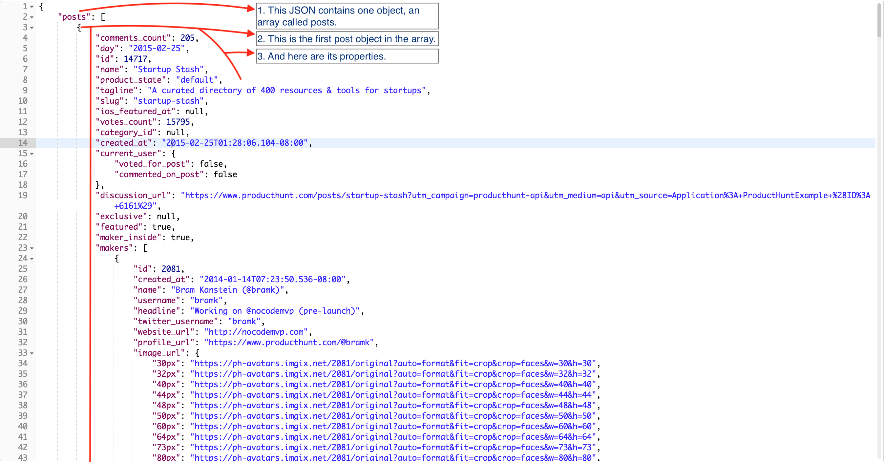

Product Hunt is an amazing platform to discover new apps and projects. We'll be making it much easier to discover the best ones that have been released recently.

# Checkout Product Hunt

You will need to sign up for Product Hunt, register an application, and generate the token needed to use the API in our app.

Explore the Product Hunt for cool projects and ideas.

> [action]
> Go to [Product Hunt](https://www.producthunt.com/) and create an account.

With an account created you can now register an application, which will allow us to access the API.

> [action]
> Read the [API docs](https://api.producthunt.com/v1/docs/); this gives you all the information you need to use the API.

# Create An Application

In order to use the API, we'll have to register our application in the API Dashboard

From the API Docs page,

> [action]
> Click the link at top right labeled "API Dashboard" to navigate to the API Dashboard.
>
> Click on _ADD AN APPLICATION_.
>
> Give your application a name and the following redirect URI:
> `https://localhost:3000/users/auth/producthunt/callback`
>
> Click on _CREATE TOKEN_ to generate the access token you'll use in your application.
>
> Your dashboard should now look similar to this:
> 

# Make a GET Request with Postman

Now that we have access to the API, let's check out the structure of the data we'll be receiving. To do this, we'll use Postman.

Postman is an API Development Environment (ADE) and an awesome tool for any developer working with APIs. We'll be using it in this tutorial to test making requests to the Product Hunt API and analyze the data we get to model the data in Swift.

> [action]
> Download the [Postman desktop app](https://www.getpostman.com/) from their website if you don't have it already. You don't need an account to use it.

Upon opening Postman, you should see this welcome screen:

> [action]
> Choose **Request** under building blocks to create a new request called **GET Posts** and save it a new collection called **Product Hunt**.

You can name the request whatever you want and save it whichever collection you choose; for this tutorial I'll be naming the request **GET Posts** and saving it in the **Product Hunt** collection.

> [action]
> Paste this URL into the URL field at the top of the window: `https://api.producthunt.com/v1/posts/all?sort_by=votes_count&order=desc&search[featured]=true&per_page=20`

Let's break down the URL:

> - `api.producthunt.com/v1` is the **base URL** for this API.
> - `posts/all` is the **endpoint** or **route** which gives you access to every product posted on Product Hunt (as long as you have a valid token!).
> - Everything after the **_?_** are the **parameters** of our request and each parameter is separated by **_&'s_**.
> - `sort_by=votes_count` and `order=desc` denotes that we want the resulting data to be organized by the number of votes in descending order.
> - `search[featured]=true` makes it so that we only get featured posts.
> - `per_page=20` limits the amount of posts we get to only 20. There are thousands of products listed on product hunt, we'll only need to get 20 at a time for our app.
> - Lastly, we need to include our access token in our request. Under _Authorization_, select **Bearer Token** in the drop down and paste your access token you generated on the API Dashboard on Product Hunt. Be sure to hit _Preview Request_.

> [action]
> Hit send. You should receive is the data from Product Hunt as a response to your request. This is what you should see:
>
> 

# Analyze Response

What you received from your request is known as **JSON (Javascript Object Notation)**, a text format that is completely language independent and easy to read.

How the data in the JSON response is organized is extremely important, especially for our app. We'll need to understand the hierarchy of the data so that we can accurately model the data in Swift.

**See if you can find a product's name, tagline, number of votes, and screenshot URL.** Take note of where these are located:

The beginning of the JSON response objects is indicated by the opening bracket `{` and ends with the closing bracket `}` on the same level. This object only contains one object which is an array of `posts`, where we will get all the information we need to display today's featured posts on our app.

The `posts` array contains the products that match the parameters given in our request. We asked for 20 of today's featured products in descending order of vote count, so we received an array with the first post being today's featured product with the highest votes.

The properties of the post object also has a hierarchy of objects. We are only concerned with `comments_count`, `id`, `name`, `tagline`, and `screenshot_url`. You can search up these terms in Postman by using the shortcut `CMD + F` and typing the name of the property in the search field that appears.

Take some time to look through Postman and see what's in the API response. This is the very beginning of learning **how to work with APIs**
