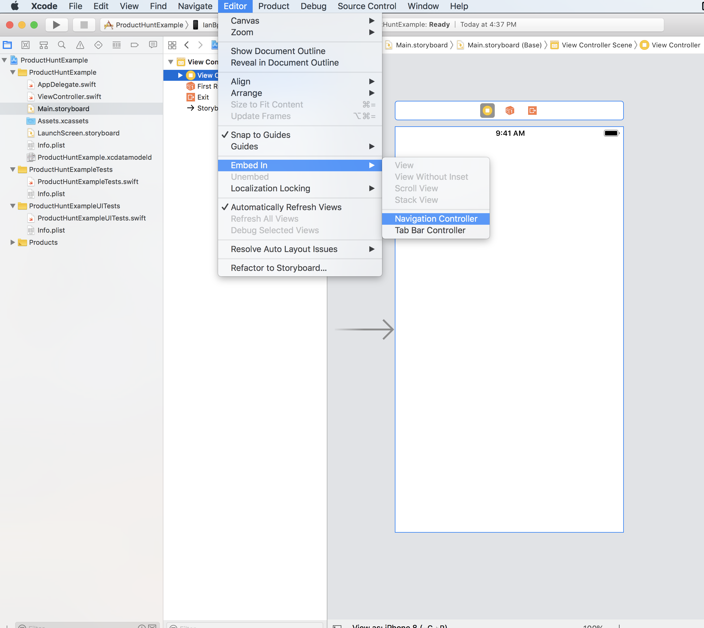
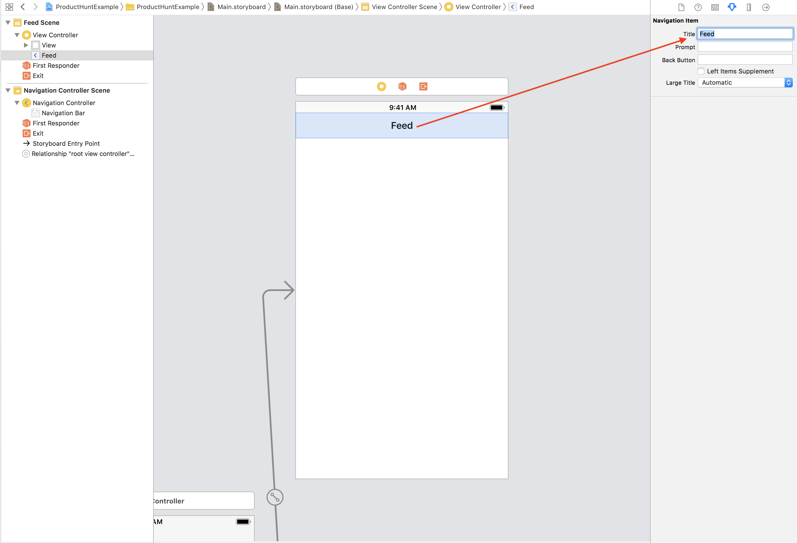
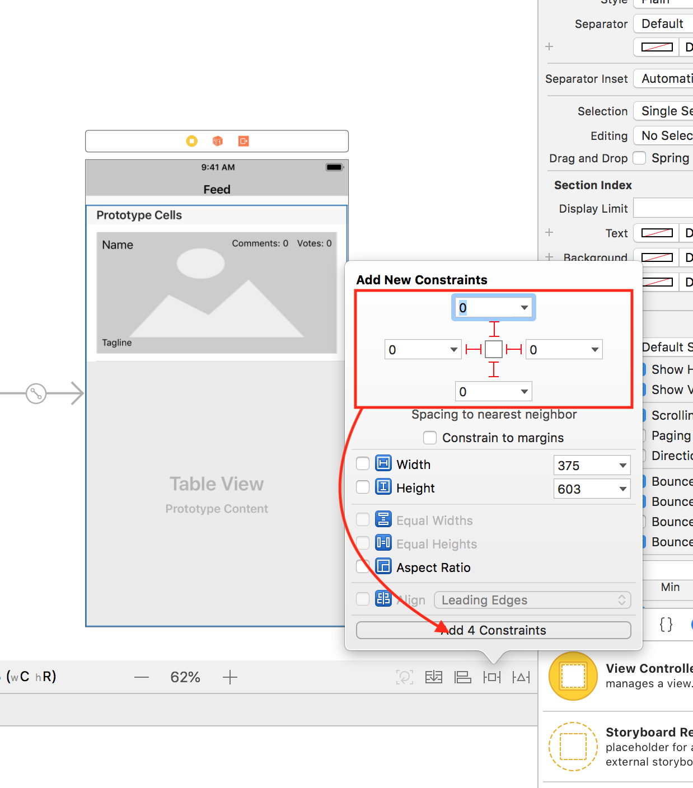
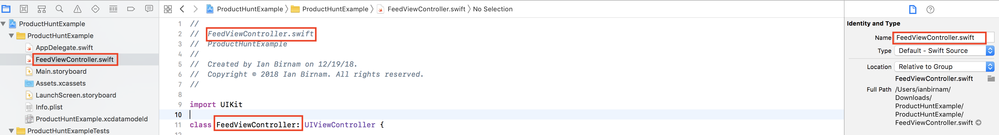
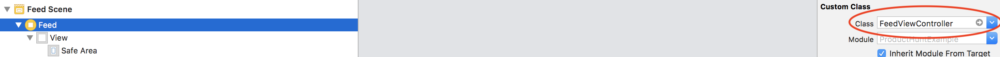
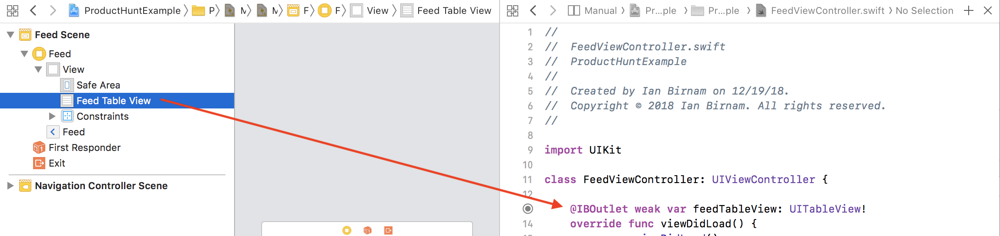

In order to avoid context switching and to reduce development time, we'll be building this app **outside-in**—starting with the UI and layout of the app, and then ending with the networking layer.

We will use the Storyboard in order to create the UI with very simple constraints. Try to resist the temptation to make complex or good looking UI this early, it'll only slow you down. You'll get an opportunity later on to polish and upgrade the app to your liking.

**Your first goal should be to get a working prototype**. The client wants the feed screen working first, so let's start with that.

# Creating the Main Screen

The `FeedView` consists of a table view with custom cells that display information about products retrieved from Product Hunt.

The UI itself is simple, with the magic happening in code. For now let's just build the UI and connect it to a Swift file.

**By the end of Part 4, here's what our storyboard will look like:**


This view is intentionally simple so that we can more easily get up and running.

We'll be using a navigation controller for this app.

> [action]
> Open `Main.storyboard` and click on the view-controller.

A shortcut for adding a navigation controller in storyboard is to **embed** a view-controller in one.

> [action]
> On the menu bar select `Editor`, then `Embed in` and finally `Navigation Controller` to quickly wrap the view controller in a navigation controller.
> 
>
> Select the `Navigation Item` under the `View Controller Scene` and  set the `Navigation Item`'s title to `Feed`.
> 

A perk of keeping things simple in the beginning is that you don't have to spend a lot of time configuring the UI.

> [action]
> Add a table view to the view controller, name it **Feed Table View**, and pin it to all 4 sides.
> 

# Prepare the Swift file

To adhere to good coding conventions, rename the view controller to `FeedViewController` to better reflect what its used for.

> [action]
> Change the name in the file inspector, for the class, and in the comments at the top of your file.
> 
We don't have any data yet, but let's add the functions that we'll be using to update cells.
>
> Add an **extension** for UITableViewDataSource at the bottom of `FeedViewController` to separate code needed to fill the table view with data.
>
``` swift
class FeedViewController: UIViewController {
  ...
}
>
// MARK: UITableViewDataSource
extension FeedViewController: UITableViewDataSource {
   /// Determines how many cells will be shown on the table view.
   func tableView(_ tableView: UITableView, numberOfRowsInSection section: Int) -> Int {
       return 3
   }
>
   /// Creates and configures each cell.
   func tableView(_ tableView: UITableView, cellForRowAt indexPath: IndexPath) -> UITableViewCell {
       return UITableViewCell()
  }
}
```

<!-- -->

> [info]
> Extensions add new functionality to an existing `class`, `struct`, `enum`, or `protocol` type.
> This includes the ability to extend types for which you do not have access to the original source code (known as retroactive modeling).

<!-- -->

> [action]
> Add an **extension** for `UITableViewDelegate` right below that.
>
``` swift
...
>
// MARK: UITableViewDelegate
extension FeedViewController: UITableViewDelegate {
  // Code to handle cell events goes here...
}
```

We'll use this later to setup selecting and deleting cells.

> [action]
> Change the class of `View Controller` to be `FeedViewController`. This will change its name from `View Controller` to `Feed`
> 
>
> Create an `IBOutlet` from the `Feed Table View` to `FeedViewController`.
> 

Because the `FeedViewController` **conforms** to both the `UITableViewDataSource` and `UITableViewDelegate` in the **extensions**, we can set the `feedTableView`'s data source and delegate to be the `FeedViewController`.

> [action]
> Set the `delegate` and `dataSource` for the table-view by typing the following code in your `viewDidLoad`:
>
```swift
feedTableView.dataSource = self
feedTableView.delegate = self
```
>

The table view is fully connected and working. You can run the app to see the one cell created thanks to the lines of code we put in the `UITableViewDataSource`.

We're going to be working a lot more with these views later on in the tutorial, but now you've got a sense of **how to display data in tableviews with custom UI!**

# Set up Git/GitHub

>[action]
> Make your first commit
>
```bash
$ git init
$ git add .
$ git commit -m 'project init'
```

Now go to GitHub and create a public repository called `Product-Hunt-API`, and now associate it as a remote for your local git project and then push to it.

>[action]
> Push it!
>
```bash
$ git remote add origin GITHUB-REPO-URL
$ git push origin master -u
```
