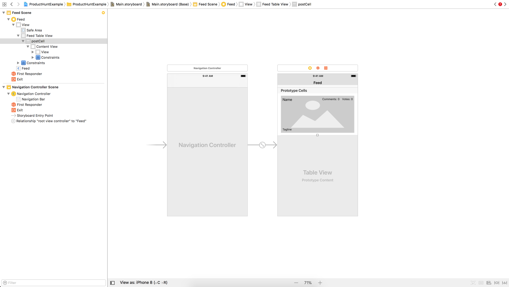
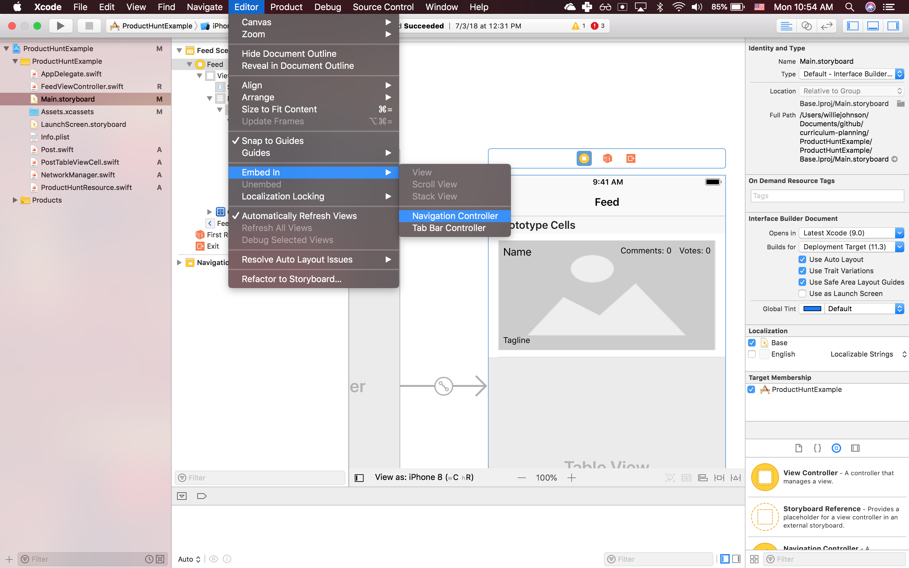

In order to avoid context switching and to reduce development time, we'll be building this app **outside-in**—starting with the UI and layout of the app and then ending with the networking layer.

We will use the Storyboard in order to create the UI with very simple constraints. Try to resist the temptation to make complex or good looking UI this early, it'll only slow you down. You'll get an opportunity later on to polish and upgrade the app to your liking.

**Your first goal should be to get a working prototype**. The client wants the feed screen working first, so let's start with that.

# Create Feed View

The `FeedView` consists of a table view with custom cells that display information about products retreived from Product Hunt.

The UI itself is simple, with the magic happening in code. For now let's just build the UI and connect it to a Swift file.

Here's what the result will look like:



Simple, but quick and easy to make.

Open Main.storyboard and click on the view controller.

1. On the menu bar select `Editor`, then `Embed in` and finally `Navigation Controller` to quickly wrap the view controller in a navigation controller.
    
2. Set the view controller's title to `Feed`.
    
3. Add a table view to the view controller and pin it to all 4 sides.
    

## Prepare the Swift file

1. To adhere to doing conventions, rename the view controller to `FeedViewController`. Change the name in the file inspector, for the class, and in the comments at the top of your file.
    
2. Add an extension for UITableViewDataSource to seperate code needed to fill the table view with data.
    ``` swift
    // MARK: UITableViewDataSource
    extension FeedViewController: UITableViewDataSource {
        /// Determines how many cells will be shown on the table view.
        func tableView(_ tableView: UITableView, numberOfRowsInSection section: Int) -> Int {
            return 1
        }

        /// Creates and configures each cell.
        func tableView(_ tableView: UITableView, cellForRowAt indexPath: IndexPath) -> UITableViewCell {
            return UITableViewCell()
        }
    }
    ```
3. Add the extension for UITableViewDelegate without any code inside. We'll use this later to setup deleting and selecting cells.
    ``` swift
    // MARK: UITableViewDelegate
    extension FeedViewController: UITableViewDelegate {
    }
    ```
4. Connect the table view to `FeedViewController`.
    
5. Set the delegate and datasource for the table view by typing the following code in your `viewDidLoad`:
    ```swift
    feedTableView.dataSource = self
    feedTableView.delegate = self
    ```

# Create Post Model

We will model the information we will be getting for each posting. The properties we need are the products id, name, tagline, number of votes, and number of comments.

1. Create a new swift file called `Post.swift`.
2. Create a struct called `Post`.
3. Give it an `id: Int`, `name: String`, `tagline: String`, `votesCount: Int`, and `commentsCount: Int`.

# Create Custom Cell

The default cell only has room for a string of text. We need it to display more than that.

We will need 4 labels, for the name and tagline and the number of voutes and comments, which will be grouped together in a stack view. We'll also add an image view to display the screenshot of each product.

1. Add one prototype cell
2. Get placeholder image
3. Add a container view and pin to sides
4. Add imageView with placeholder image
5. Add name label
6. Add tagline label with reduced font size
7. Add horizontal stack view with comments and votes label with reduce font size and pin to top and right
8. Set identifier to postCell.

# Configure Tableview to Use Custom Cell

1. Set number of cells to 3 for testing purposes.
2. Guard let to dequeue post cells.
3. Run to see how it looks!

# Create Post Tableview Cell

1. Set custom class to PostTableViewCell.swift for custom cell in storyboard.
2. Connect IBOutlets.
3. Run!

# Use Mock Data to Test Feed View

1. Create list of Posts with mock data.
2. Set tableview to use mock data count.
3. Cast dequed cell as PostTableViewCell.
4. Use didSet to set to easily update labels.
