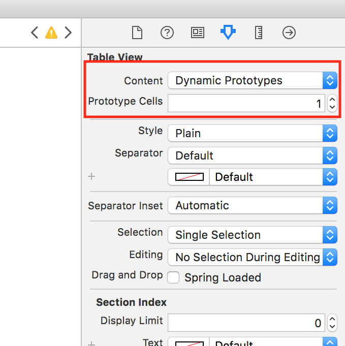

---

title: "Creating the Custom Cell UI"
slug: creating-the-custom-cell

---

The default cell only has room for a string of text. We need it to display more than that.

We will need 4 labels, for the _name_, _tagline_, _number of votes_, and _comments_, which will be grouped together in a stack view. We'll also add an image view to display the product's screenshot.

Create a new cell in Storyboard that we can customize.

> [action]
> Open storyboard and open the table view's `Attribute Inspector` to give it a Dynamic Prototype Cell.
> 

It's a bit too small at the moment, but we can easily increase the size.

> [action]
> Increase the size of the cell to 250 in the **Size Inspector**
> 

We'll use the view that comes with the cell, labeled `Content View` in Storyboard, as the cell's **background**; so leave that transparent. We'll add a new UIView which will act as a **container** for all the views that will display information about the product.

> [action]
> Drag a UIView into the prototype cell and Pin it on all 4 sides of the `Content View`.

Now we can add the necessary labels. Let's start with the **name label**

> [action]
> Add a UILabel pinned to the top and left of the newly added `Container View`.
>
> Give the label the text "Name" so we can see it better in Storyboard.

Then the **comments label** and **votes label**, which can be grouped together in a `UIStackView`.

> [action]
> Pin a horizontal UIStackView to the top and right of the `Container View`
>
> Place 2 labels inside and type "Comments: 0" for the left label and "Votes: 0" for the right label.

To give the text some room to display information, we can reduce the font size of both labels to 12.

> [action]
>  Select both labels in the stack view and change their font size to 12 in the `Attribute Inspector`.

Next up is the UIImageView which will display the product's **screenshot**.

> [action]
> Add an UIImageView to the center of the cell and pin it to all 4 sides of the `Container View` with the following constraints:
> 
>
> You can set the image to whatever you want. Download free placeholder images [here](https://placeholder.com/).

The last thing we'll add is the label for the **tagline**.

> [action]
> Add a label pinned to the left, bottom, and right of the `Container View` and give it some content.
>
> Set the font size of this label to 12.

To be able to use this custom cell in code it needs to have an **identifier**.

> [action]
> Set the `Identifier` of the cell to `postCell` in the cell's `Identity Inspector`.

Now we have all the UI built out to display the information we'll be getting from the API.

> [solution]
> 
