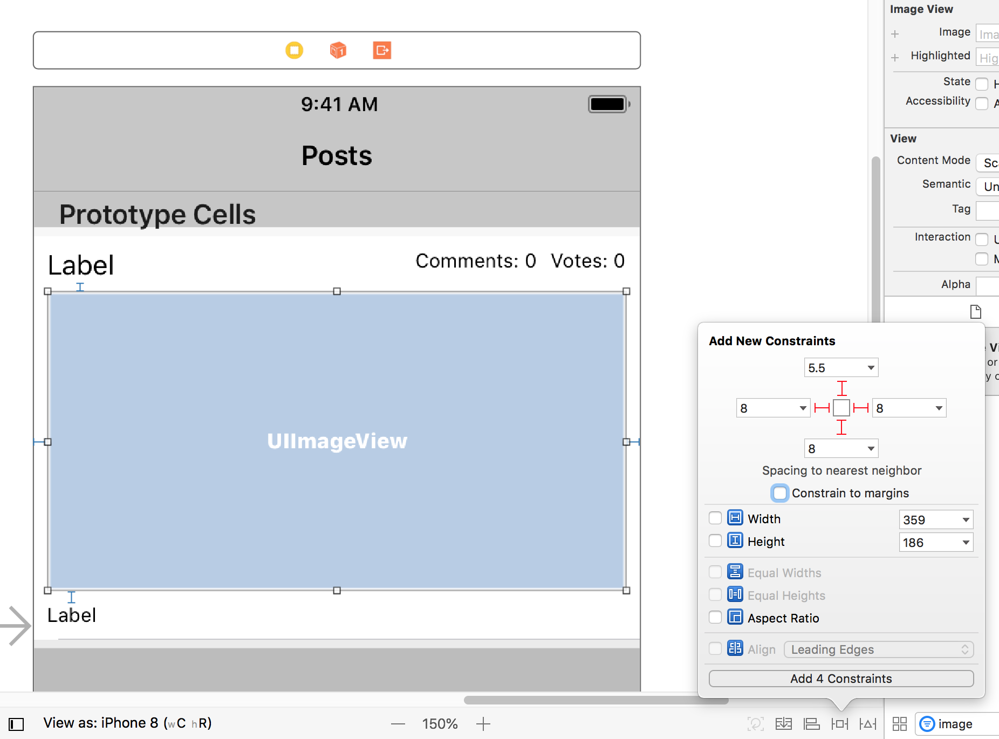

The default cell only has room for a string of text. We need it to display more than that.

We will need 4 labels, for the _name_, _tagline_, _number of votes_, and _comments_, which will be grouped together in a stack view. We'll also add an image view to display the product's screenshot.

Lets create a new cell in Storyboard that we can customize.

> [action]
> Open storyboard and open the table view's `Attribute Inspector` to give it a Dynamic Prototype Cell.
> 

It's a bit too small at the moment, but we can easily increase the size.

> [action]
> Increase the size of the Table View Cell to 250 in the **Size Inspector**
> 

We'll use the view that comes with the cell, labeled `Content View` in Storyboard, as the cell's **background**; so leave that transparent. We'll add a new UIView which will act as a **container** for all the views that will display information about the product.

> [action]
> Drag a UIView into the prototype cell and Pin it on all 4 sides of the `Content View`.

Now we can add the necessary labels. Let's start with the **name label**

> [action]
> Add a UILabel pinned to the top and left of the newly added `Container View`.
>
> Give the label the text "Name" so we can see it better in Storyboard.

Then the **comments label** and **votes label**, which can be grouped together in a `UIStackView`.

> [action]
> Pin a horizontal UIStackView to the top and right of the `Container View`
>
> Place 2 labels inside and type "Comments: 0" for the left label and "Votes: 0" for the right label. Name the labels **Comments Count Label** and **Votes Count Label** respectively.
>
> Give the labels some spacing by selecting the stack view and setting the **Spacing** to 8.

To give the text some room to display information, we can reduce the font size of both labels to 12.

> [action]
>  Select both labels in the stack view and change their font size to 12 in the `Attribute Inspector`.


For names that have a longer names, we have to constrain the right side of the name label to not extend longer than the stack view containing the comment and vote counts.

> [action]
>  Select the name label and create a right horizontal spacing constraint with a spacing of 12 from the `Add a Constraint` pop over. This will constraint the label to its nearest neighbor which is the horizontal stack view.
>
>  Select the name label, go to the **Size Inspector** and scroll down to **Content Hugging Priority** and change the value for **Horizontal** from 251 to 250. This allows the name label to take up the extra horizontal space the comment label and votes label didn't take up.

Next up is the label for the **tagline**.

> [action]
> Add a label pinned to the left, bottom, and right of the `Container View` and change its Text to say "Tagline".
>
> Set the font size of this label to 12.

The last thing we'll add is the UIImageView which will display the product's **screenshot**.

> [action]
> Add an UIImageView (name it **Preview Image View**) to the center of the cell and pin it to all 4 sides of the `Container View` with the following constraints:
> 
>
> You can set the image of the image view to whatever you want. Download free placeholder images [here](https://placeholder.com/). Add [this](http://via.placeholder.com/350x160) to your **Assets.xcassets** file in your Xcode project and rename the file to **placeholder.png**. Finally, select placeholder.png as the Image for the UIImageView under the Attribute Inspector.
>
> Lastly, select the image view update the **Content Hugging Priority** value for **Vertical** from 251 to 250. This allows the image view to take up the extra vertical space the Name label and tagline label didn't take up.

To be able to use this custom cell in code it needs to have an **identifier**.

> [action]
> Set the `Identifier` of the cell to `postCell` in the cell's `Identity Inspector`.

Now we have all the UI built out to display the information we'll be getting from the API. We're getting more comfortable with **displaying data in tableviews with custom UI** as well as beginning to learn **how to take advantage of mock data** through using the `placeholder` image. We'll keep working on each of those as we continue.

Check out the completed custom cell below. Note that your constraints may not exactly match what is shown below. The important thing is that the layout matches, and that you followed the constraints properly as described in this section.

> [solution]
> Click on the image if you want to see all the information on the Project Navigator:
> 

# Now Commit

```bash
$ git add .
$ git commit -m 'Completed Post Cell view'
$ git push
```
