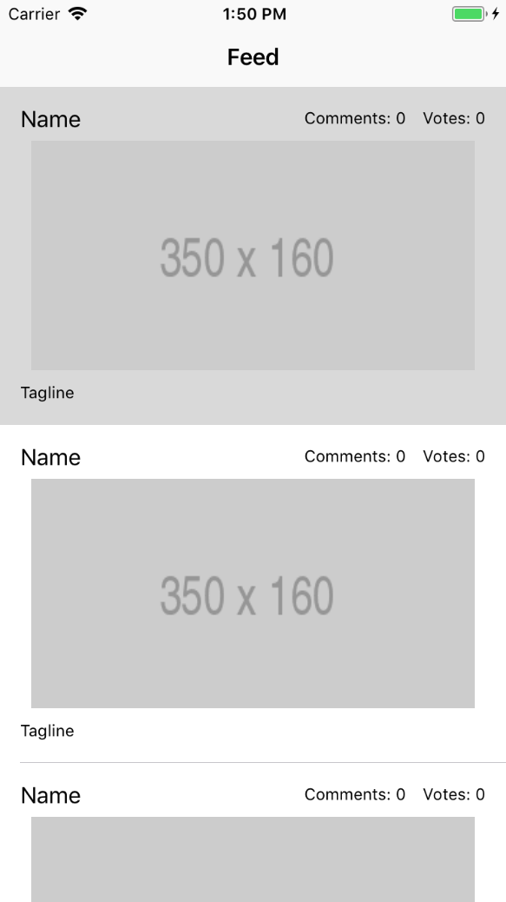

With our custom cell setup, we now have all the UI elements we need to see the `Feed View` in action. However, we won't be making any network requests just yet; instead we'll use **mock data** to emulate the data that we will receive from an API request.

# Test Without UI Without Data

First let's test things without using any real data from Product Hunt's API.

> [action]
> Open `FeedViewController.swift` and go to the `UITableViewDataSource` extension to update the body of the **second** `tableView` method using the code below (check the parameters so that you're sure you're updating the right method):
>
```swift
func tableView(_ tableView: UITableView, cellForRowAt indexPath: IndexPath) -> UITableViewCell {
   let cell = tableView.dequeueReusableCell(withIdentifier: "postCell", for: indexPath) as! PostTableViewCell
>
   return cell
}
```

We dequeue a cell using the `postCell` identifier we provided in Storyboard earlier and simply return it.

> [info]
> The first line in the above function uses the method `dequeueReusableCell(withIdentifier:)`
>
> This is used for performance reasons as it **dequeues** any available cells and returns it as the table-view cell associated with the identifier provided, skipping a lot of the overhead needed to create an entirely new cell.

We also need to update the size of the cell in our `FeedViewController`.

> [action]
> Go to the `UITableViewDelegate` extension and add the following method
>
```swift
func tableView(_ tableView: UITableView, heightForRowAt indexPath: IndexPath) -> CGFloat {
  return 250
}
```

Run the app to see how it looks 👌

You should see something awesome like this:


# Use Mock Data To Display Information

Using Mock Data allows us to easily test our app without having to create an entire networking layer. We'll simply create an array with `Post` objects and provide the data for each post ourselves.

> [action]
> Create an array of Posts in `FeedViewController`, below your `IBOutlet feedTableView` using a closure.
>
``` swift
...
>
var mockData: [Post] = {
   var meTube = Post(id: 0, name: "MeTube", tagline: "Stream videos for free!", votesCount: 25, commentsCount: 4)
   var boogle = Post(id: 1, name: "Boogle", tagline: "Search anything!", votesCount: 1000, commentsCount: 50)
   var meTunes = Post(id: 2, name: "meTunes", tagline: "Listen to any song!", votesCount: 25000, commentsCount: 590)
>
   return [meTube, boogle, meTunes]
}()
```

The data is essentially fake, so you can create whatever product you want!

We can now use this array as a **datasource** for the table view, allowing us to provide data for the labels in the custom cell we created.

> [action]
> Update the following methods in the `UITableViewDataSource` extension:
>
```swift
func tableView(_ tableView: UITableView, numberOfRowsInSection section: Int) -> Int {
  return mockData.count
}
>
func tableView(_ tableView: UITableView, cellForRowAt indexPath: IndexPath) -> UITableViewCell {
  let cell = tableView.dequeueReusableCell(withIdentifier: "postCell", for: indexPath) as! PostTableViewCell
>
  let post = mockData[indexPath.row]
  cell.post = post
>
  return cell
}
```

Because we used a property observer to update the labels, we only need to set the cell's `post` property to give it the data it needs.

Run the app again to see how it looks. You should see the cell's filled with the information provided by our mock data:


We've successfully integrated **the use of mock data** into our app! We are now ready to get into networking! But first we need to update our model.

# Now Commit

```bash
$ git add .
$ git commit -m 'Tests with mock data'
$ git push
```
