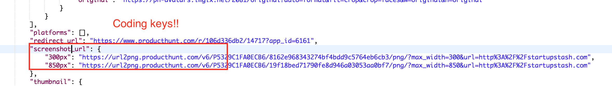
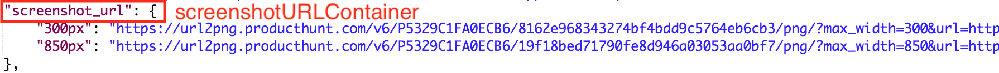

In order for this model to work well with network requests, we will make it **decodable**. Making our model [decodable](https://developer.apple.com/documentation/foundation/archives_and_serialization/encoding_and_decoding_custom_types) means that we can take information from external resources (such as the Product Hunt API) and transform it into something that works with our models, like our `Post` model!

# Getting Started

First, let's add a variable for the preview image url:

> [action]
> Add previewImageUrl variable at the bottom of `Post` model.
>
```swift
 ...
 let previewImageURL: URL
}
```

This will hold the link to the screenshot of the product and will allow us to download the image later on.

Next, let's make `Post` **decodable** by conforming to the `Decodable` protocol.

> [action]
> Create an `extension` at the bottom of your `Post` model that makes it `decodable`. We're extending it for ease of readability since we're going to be adding more code later.
>
```swift
struct Post {
    // current code
}
>
// MARK: Decodable
extension Post: Decodable {
>
}
```

# Add Coding Keys

We'll need to define **coding keys** to tell Swift exactly where to find the information to fill the model's variables. However, we actually only need this because the Product Hunt API uses a different naming convention for it's properties.

> [action]
> Create an `enum` called `PostKeys` with the raw type as `String` and conforms to `CodingKey` and place it inside the `Post: Decodable` extension.
>
```swift
extension Post: Decodable {
    // properties within a Post returned from the Product Hunt API that we want to extract the info from.
    enum PostKeys: String, CodingKey {
        // first three match our variable names for our Post struct
        case id
        case name
        case tagline
        // these three need to be mapped since they're named differently on the API compared to our struct
        case votesCount = "votes_count"
        case commentsCount = "comments_count"
        case previewImageURL = "screenshot_url"
    }
}
```
>
> 

Note how only `votesCount`, `commentsCount`, and `previewImageUrl` are the only variables that are set to a string. This is because in the JSON we receive from the request, these variables are named differently (using **snake_case**, rather than **camelCase** which is the recommended practice for Swift).

In fact, if we did not plan to collect these variables from the JSON, we would not need to create any **coding keys**.

Also, there are cases where you simply what to rename the property differently, such as for the `previewImageUrl`. We'll create a coding key for that as well and put it in our `Post: Decodable` extension:

> [action]
> Add a CodingKey for the preview image.
>
```swift
enum PreviewImageURLKeys: String, CodingKey {
   // for all posts, we only want the 850px image
   // Check out the screenshot_url property in our Postman call to see where this livesx
   case imageURL = "850px"
}
```
>
> 

# Initializing A Decodable

Now that we have all our necessary coding keys, the next step will be to setup the initializer for our model.

> [action]
> Add this initializer inside the `Post: Decodable` extension, below the `enums` you made earlier:
>
```swift
init(from decoder: Decoder) throws {
>
}
```

We'll first need to _extract the properties_ from the `post` object that we get back from the Product Hunt API. This is done using **containers** which uses `CodingKeys`:

> [info]
> [Containers](https://developer.apple.com/documentation/swift/decoder/2892621-container) allow the `decoders` to return their data based off of the provided `CodingKeys`

<!-- -->

> [action]
> Add this to the body of the `init` you just created:
>
```swift
// Decode the Post from the API call
let postsContainer = try decoder.container(keyedBy: PostKeys.self)
```

Now that we have stored the `post` object in a container, we can go in and grab all the information we need from it!

> [action]
> Below the `postsContainer` line, Set the variables of the `Post` using the `postContainer` you just created.
>
```swift
  ...
  // Decode each of the properties from the API into the appropriate type (string, etc.) for their associated struct variable
  id = try postsContainer.decode(Int.self, forKey: .id)
  name = try postsContainer.decode(String.self, forKey: .name)
  tagline = try postsContainer.decode(String.self, forKey: .tagline)
  votesCount = try postsContainer.decode(Int.self, forKey: .votesCount)
  commentsCount = try postsContainer.decode(Int.self, forKey: .commentsCount)
}
```
>
> 

Finally, we need to set the `previewImageURL`. The actual URL that we need from `screenshot_url` is nested within the `screenshot_url` object in the API response, so we'll need to access it through a **nested container** (more info on those [here](https://developer.apple.com/documentation/swift/keyeddecodingcontainer/2893204-nestedcontainer)) using the `PreviewImageURLKeys`:

> [action]
> Add this add the bottom of the initializer:
>
```swift
   ...
>
   // First we need to get a container (screenshot_url/previewImageURL) nested within our postsContainer.
   // If it only had a single value like the other properties, we wouldn't need to use nestedContainer
   let screenshotURLContainer = try postsContainer.nestedContainer(keyedBy: PreviewImageURLKeys.self, forKey: .previewImageURL)
   // Decode the image and assign it to the variable
   previewImageURL = try screenshotURLContainer.decode(URL.self, forKey: .imageURL)
}
```
>
> 

Now the model is ready to go! But there's one more thing we need to add to make things easier.

The products we retrieve from the API are inside the array called "posts". We can model this using a Struct:

> [action]
> Add this below your `Post` Struct, and above your `extension Post: Decodable`:
>
```swift
struct Post {
...
}
>
// Have a matching decodable array in our struct for the array of posts we get back from the API
struct PostList: Decodable {
   var posts: [Post]
}
>
extension Post: Decodable {
...
}
```

We just went through a lot of important stuff! We learned **how to decode JSON into our Swift models**, and also learned a bit more on **how to work with APIs** in order to get data flowing into our app!

We can't get our data flowing just yet though, since we have don't have a way to interface with the Product Hunt API. To do so, we'll need a networking layer, so let's get to it!

# Now Commit

```bash
$ git add .
$ git commit -m 'Decodable model'
$ git push
```
