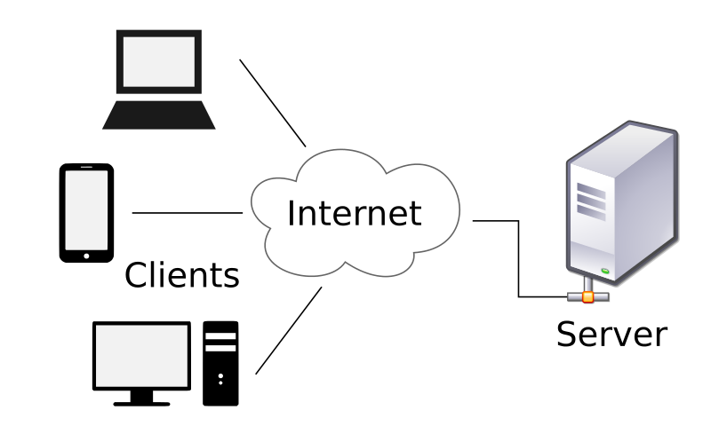

1. ~~Look at the Product Hunt API~~
1. ~~Build the Feed View~~
1. ~~Create the Post Model~~
1. ~~Build the Post Cell~~
1. ~~Create the Post Cell Class~~
1. ~~Test the Feed Table View~~
1. ~~Allow the Post Model to work with network requests~~
1. **Create the network layer**
    1. **Create a `NetworkManager` class**
    1. **Build a method to handle the GET Request for Posts**
    1. **Use `dataTask` to correctly handle requests**
1. Retrieve data from the PH API
1. Build the Comments View
1. Pull Comments data from the API
1. Update the view controllers to hook everything up

With our model prepared, the networking layer will be pretty simple to create.

# Introduction to Network Managers 
In this section, we'll be creating the network layer of the app. You may be wondering what a network manager is or even what networking in general is. Lets take a closer look before diving into code. 



Networking (aka computer networking) is how information and data get transported and exchanged between various information systems. 

Looking at the diagram, the client (in our case, the iphone or simulator) makes a request of some sort (typially some sort of information like text, images, videos, etc) to a server, the server then takes in the request and handles its response before sending the information to the client. 

Here are a few note-worthy key-terms to help you understand the parts of the networking proccess better: 

**Client**: a computer in a network that uses the services provided by a server.

**Server**: a piece of computer hardware or software (computer program) that provides functionality for other programs or devices (ie clients)

**API**: part of the server that receives requests and sends responses.

**Network Manager / Networking Layer**: a well-structured chunk of code used to make API requests and handle its responses from an external server.

What we'll be doing moving forward in this section is creating a custon networking layer that communicates with the Product Hunt API. In doing so, this is how we will be populating data in our storyboard instead of having mock data. 

The information you take away from this section will be especially helpful the further you grow in tech as majority of apps eventually communicate with the internet in some way and **this** is where it all starts. 


# Create Manager Class
Now that you're a master of the fundamentals of networking, let's get started! 

> [action]
Start by creating a new `Swift` file named `NetworkManager.swift`

We'll keep everything in a class called `NetworkManager`

> [action]
> Create a `NetworkManager` class with the following variables. Remember to replace the value of `token` with your Product Hunt API token!
>
```swift
class NetworkManager {
    // shared singleton session object used to run tasks. Will be useful later
    let urlSession = URLSession.shared
>
    var baseURL = "https://api.producthunt.com/v1/"
    var token = "replace-me-with-your-token-from-product-hunt-api-dashboard-🙏"
}
```

This is what we'll use to create the network request.

# Get Posts Method

Next we'll create the method that handles the request.

> [action]
> Create a `getPosts()` method in your new `NetworkManager` class
>
```swift
func getPosts() {
>
}
```

Because network requests require continuous data flow, this can result in different speeds depending on the network. To account for this, we'll use an **escaping closure** as a completion handler in order to return data.

Using the normal function `return` would result in inconsistent results, as the data retrieved from a request might not always be prepared before the method returns. We need to adjust the parameter list for our `getPosts` method.

> [action]
> Add an **escaping closure** to `getPosts()` as a parameter.
>
```swift
func getPosts(completion: @escaping ([Post]) -> Void)
```

The escaping closure allows the compiler to continue on to other code—**escaping the method**—and return later on when the data is ready to be returned.

## Constructing The Request

> [action]
> Add the following lines in the body of `getPosts(completion:)`
>
```swift
// our API query
let query = "posts/all?sort_by=votes_count&order=desc&search[featured]=true&per_page=20"
// Add the baseURL to it
let fullURL = URL(string: baseURL + query)!
// Create the request
var request = URLRequest(url: fullURL)
```

This uses the `baseURL` of the API in addition to the parameters we established earlier to construct a request instance.

We'll configure the request before we send it off.

> [action]
> Add these lines underneath the previous 3 for `getPosts(completion:)`
>
```swift
...
>
// We're sending a GET request, so we need to specify that
request.httpMethod = "GET"
// Add in all the header fields just like we did in Postman
request.allHTTPHeaderFields = [
   "Accept": "application/json",
   "Content-Type": "application/json",
   "Authorization": "Bearer \(token)",
   "Host": "api.producthunt.com"
]
```

To send the request we'll use the [dataTask](https://developer.apple.com/documentation/foundation/urlsession/1411554-datatask) method on our `urlSession`

> [action]
> Add the following to the bottom of `getPosts`
>
```swift
  ...
>
  let task = urlSession.dataTask(with: request) { data, response, error in
>   
  }
>
```

The `dataTask` method executes the `request` provided and the completion handler returns the result as `data`, a `response`, and an `error` if there is any reasons for an incomplete request. This method returns us a `URLSessionDataTask` object (`task`) which we can invoke `cancel()`, `suspend()` or `resume()`. We can also check its progress.

We'll check to see if there is an error first and then if there is any data to **decode**.

> [action]
> Add the following inside the `dataTask(with:)` completion handler
>
```swift
let task = urlSession.dataTask(with: request) { data, response, error in
   // error check/handling
   if let error = error {
       print(error.localizedDescription)
       return
   }
>
   // make sure we get back data
   guard let data = data else {
       return
   }
}
```

These lines make sure that we have data to work with and that no error occurred. If either of those are not true, then we return.

Once we get past those checkpoints, we can decode the data.

> [action]
> Use `JSONDecoder` to decode the data retrieved into a `PostList`
>
```swift
let task = urlSession.dataTask(with: request) { data, response, error in
   ...
>
   // Decode the API response into our PostList object that we can use/interact with
   guard let result = try? JSONDecoder().decode(PostList.self, from: data) else {
       return
   }
}
```

<!-- -->

> [info]
> `JSONDecoder().decode` automatically decodes any `Decodable`.

If the `Post` is modeled correctly, `JSONDecoder().decode(...)` will continue on to the next step: returning the result as an array of posts!

> [action]
> Add the following to the bottom of the `dataTask` completion Handler
>
```swift
let task = urlSession.dataTask(with: request) { data, response, error in
   ...
>
   let posts = result.posts
>
   // Return the result with the completion handler.
   DispatchQueue.main.async {
       completion(posts)
   }
}
```

Since our `getPosts(...)` method performs a network call on a separate queue – a **background queue** – we therefore need to execute our completion handler on the **main queue** since all UI code must execute on the main queue.

>[info]
> We use the **main queue** for UI-related tasks, whereas any other time-consuming tasks should run on **background queues**. This is done so that the UI doesn't freeze up for the user while the app is running other tasks.

One last thing we need to do is resume the `dataTask`. By default, `dataTasks` are paused. We'll have to resume it to start the task:

> [action]
>
```swift
let task = urlSession.dataTask(with: request) { data, response, error in
    ...
>
}
>
task.resume()
```

Networking layer is now complete (for now) 👌

> [solution]
>
```swift
class NetworkManager {
 let urlSession = URLSession.shared
 var baseURL = "https://api.producthunt.com/v1/"
 var token = "replace-me-with-your-token-from-product-hunt-api-dashboard-🙏"
>
 func getPosts(completion: @escaping ([Post]) -> Void) {
   // Construct the URL to get posts from API.
   let query = "posts/all?sort_by=votes_count&order=desc&search[featured]=true&per_page=20"
   let fullURL = URL(string: baseURL + query)!
   var request = URLRequest(url: fullURL)
>
   request.httpMethod = "GET"
   // Set up header with API Token.
   request.allHTTPHeaderFields = [
     "Accept": "application/json",
     "Content-Type": "application/json",
     "Authorization": "Bearer \(token)",
     "Host": "api.producthunt.com"
   ]
>
   let task = urlSession.dataTask(with: request) { data, response, error in
     // Check for errors.
     if let error = error {
       print(error)
       return
     }
>
     // Check to see if there is any data that was retrieved.
     guard let data = data else {
       return
     }
>
     // Attempt to decode the data.
     guard let result = try? JSONDecoder().decode(PostList.self, from: data) else {
       return
     }
>
     let posts = result.posts
>
     // Return the result with the completion handler.
     DispatchQueue.main.async {
         completion(posts)
     }
   }
>
   task.resume()
 }
}
```

Alright! We just learned **how to build a network layer in Swift!** Now we can start removing our mock data and put in real data from Product Hunt!

Let's use our `getPosts(...)` method in the `FeedViewController` to do so! But first...

# Now Commit

```bash
$ git add .
$ git commit -m 'Created networking layer'
$ git push
```
