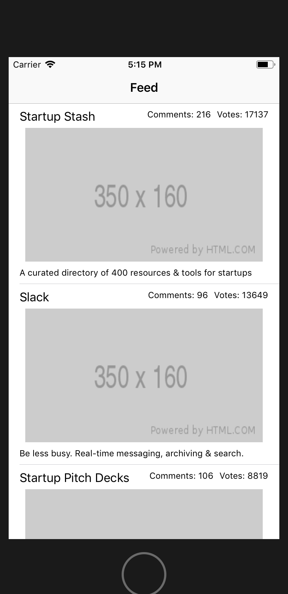

Now that the network manager is complete, we can retrieve real data from Product Hunt through their API!

The next step would be to tie it in with our UI and have the main feature of our app (browsing featured products on Product Hunt) completed.

Let's start by adding a `NetworkManager` to `FeedViewController`

> [action]
> Open `FeedViewController.swift` and add a `NetworkManager` property below your `mockData` list.
>
```swift
var mockData: [Post] = {
    ...
}()
>
var networkManager = NetworkManager()
```

# Replace Mock Data

Now we can replace `mockData` with the list that will be holding the products retrieved from the API.

> [action]
> Replace the `mockData` list with an empty `posts` list.
>
```swift
...
>
var posts: [Post] = []
>
...
```

We can use another property observer here to update the `feedTableView` every time the `posts` is updated.

> [action]
> Add a `didSet` property observer to `posts` to update the view.
>
```swift
var posts: [Post] = [] {
   didSet {
       feedTableView.reloadData()
   }
}
```

Next we'll update the places where `mockData` was used to use our newly created optional `posts` list.

> [action]
> Update the the following methods in the `UITableViewDataSource` extension to use `posts` rather than `mockData` list.
>
```swift
func tableView(_ tableView: UITableView, numberOfRowsInSection section: Int) -> Int {
 return posts.count
}
>
func tableView(_ tableView: UITableView, cellForRowAt indexPath: IndexPath) -> UITableViewCell {
 let cell = tableView.dequeueReusableCell(withIdentifier: "postCell", for: indexPath) as! PostTableViewCell
>
 let post = posts[indexPath.row]
 cell.post = post
 return cell
}
```

Now we can tie everything together.

# Update Posts List With NetworkManager

We'll use a method that runs inside `viewDidLoad` to update the feed of the app.

> [action]
> Create the method `updateFeed()` below `viewDidLoad()` method.
>
```swift
...
>
func updateFeed() {
>
}
```

All we have to do is update the `posts` list with the data retrieved from a request to the API.

> [action]
> Use `getPosts()` method to update `posts` list.
>
```swift
func updateFeed() {
   networkManager.getPosts() { result in
       self.posts = result
   }
}
```
>
> Add `updateFeed()` at the bottom of `viewDidLoad()`
>
```swift
   ...
>
   updateFeed()
}
```

That's it 👏 Run the app to see it in action.



Notice that we still don't have images for each of the cells. If we look at `PostTableViewCell`, we're still using `placeholder` for our image. We'll revisit updating this towards the end of this tutorial, so don't worry about it for now!

Instead, celebrate the fact that we have now completed the first 2 user stories:

> - I can browse products featured today on Product Hunt by scrolling through the app’s main screen.
> - I see each product’s name, tagline, number of votes.

Let's move on to the final user story!
