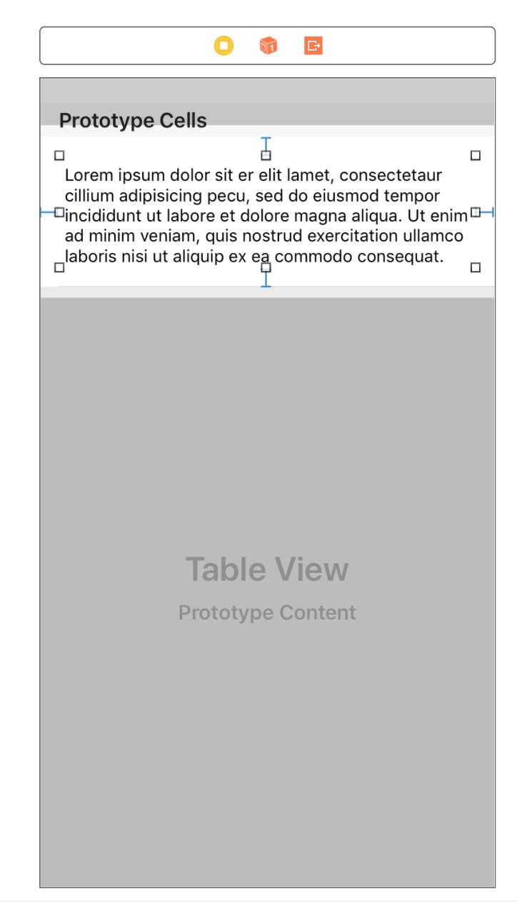

---

title: "Building The Comments View"
slug: comments-view

---

Now we can move on to the second part of the app. The `CommentsView` which will show the comments of a tapped product.

This view is much simpler than the `FeedView` and doesn't require much work to get it setup with the API, but we will be refactoring some of our code to improve its quality and reduce repetitive code.

# Building The UI

The `CommentsView` is also a view which utilizes a `UITableView` with a custom made cell to display an array of information.

We'll start by creating both the view and the cell. You should know how to create these on your own by now.

> [action]
> Open Storyboard and add a new `UIViewController` `UITableView` with a `UITableView` pinned to all sides of its view.

The cell will consist of a single `UITextView` that fills the cell with padding on the sides.

> [action]
>
> Add a prototype cell with the **identifier `commentCell`**, a **height of 125**, and a **`UITextView` with 15 points of padding** on all sides.
>
> 

We don't want to make comments editable, so let's disable that for the text-view in the cell.

> [action]
> Disable `Editable` behavior for the text-view in its `Attribute Inspector`.

And that's it!

# Create CommentsViewController

Now we can setup the code.

> [action]
> Create a `UIViewController` class called `CommentsViewController`

Connect the class to the view-controller.

> [action]
> Set class of newly added view-controller to `CommentsViewController` and its `Storyboard ID` to `commentsView` in the `Identity Inspector`.

Connect the table-view to the class.

> [action]
> Create an IBOutlet for the `UITableView` named `commentsTableView` and set its `delegate` and `dataSource` to `self`

Create an optional array of strings to hold the comments and updates the table-view.

> [action]
> Add variable `comments: [String]?` to `CommentsViewController` with a `didSet` property observer to **reload** `commentsTableView`.

Next we setup the necessary methods for our `commentsTableView` to work.

> [action]
> Create extensions for `CommentsViewController` which inherit from `UITableViewDataSource` and add the methods to pull information from the `comments` list
>
> ```swift
>  // MARK: UITableViewDatasource
>  extension CommentsViewController: UITableViewDataSource {
>  func tableView(_ tableView: UITableView, numberOfRowsInSection section: Int) -> Int {
>     guard let comments = comments else {
>       return 0
>     }
>     return comments.count
>   }
>
>   func tableView(_ tableView: UITableView, cellForRowAt indexPath: IndexPath) -> UITableViewCell {
>     guard let comments = comments, let cell = tableView.dequeueReusableCell(withIdentifier: "commentCell") as? CommentTableViewCell else {
>       return UITableViewCell()
>     }
>
>     let comment = comments[indexPath.row]
>     cell.commentTextView.text = comment
>     return cell
>   }
> }
>
> ```

Next we'll create the `CommentTableViewCell` that will allow the last method to work with a custom cell.

# Create CommentTableViewCell

This cell is much simpler and requires very little code.

> [action]
> Create a new `UITableViewCell` class named `CommentTableViewCell` and connect `IBOutlet` with text-view in prototype.
>
> ```swift
> class CommentTableViewCell: UITableViewCell {
>    @IBOutlet weak var commentTextView: UITextView!
> }
> ```
>
> All this cell class needs is one line for the `IBOutlet`.

Now we can test it with mock data.

# Connect The Views

Now we can setup the tap handler for our table-view to present the comments of a post.

The method that allows us to do this is from the `UITableViewDelegate` which gives us access to the cell that a user selects.

> [action]
> Add `didSelect` method to `UITableViewDelegate` extension.
>
> ```swift
> ...
>
> func tableView(_ tableView: UITableView, didSelectRowAt indexPath: IndexPath) {
>     guard let posts = posts else {
>       return
>     }
>     let post = posts[indexPath.row]
> }
> ```

We don't have the method necessary to get the comments of a post, so instead we'll use mock data to to test how everything looks first.

> [action]
> Add this to `didSelectRowAt` method to present a `CommentsViewController` with fake comments.
>
> ```swift
>   ...
>
>   let storyboard = UIStoryboard(name: "Main", bundle: Bundle.main)
>   guard let commentsView = storyboard.instantiateViewController(withIdentifier: "commentsView") as? CommentsViewController else {
>     return
>   }
>   commentsView.comments = ["Blah blah blah!", "Good app.", "Wow."]
>   navigationController?.pushViewController(commentsView, animated: true)
> }
> ```

Run the app and test it out to see how it looks.
