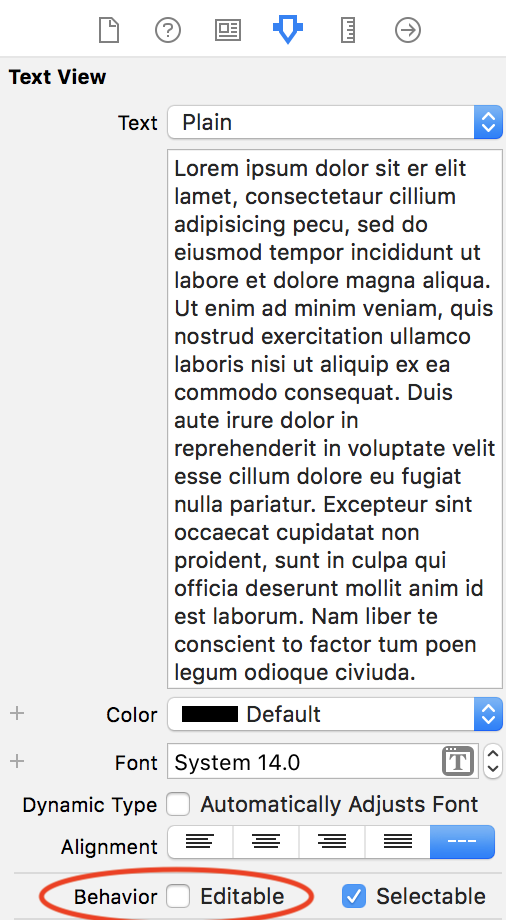

1. ~~Look at the Product Hunt API~~
1. ~~Build the Feed View~~
1. ~~Create the Post Model~~
1. ~~Build the Post Cell~~
1. ~~Create the Post Cell Class~~
1. ~~Test the Feed Table View~~
1. ~~Allow the Post Model to work with network requests~~
1. ~~Create the network layer~~
1. ~~Retrieve data from the PH API~~
1. **Build the Comments View**
    1. **Build the UI**
    1. **Create the view controller**
    1. **Create the CommentTableViewCell**
    1. **Connect the views**
1. Pull Comments data from the API
1. Update the view controllers to hook everything up

Now we can move on to the second part of the app. The `CommentsView` which will show the comments of a tapped product.

This view is much simpler than the `FeedView` and doesn't require much work to get it setup with the API, but we will be refactoring some of our code to improve its quality and reduce repetitive code.

# Building The UI

The `CommentsView` is also a view which utilizes a `UITableView` with a custom made cell to display an array of information.

We'll start by creating both the view and the cell.

> [action]
> Open Storyboard and add a new `UIViewController` scene from the Object Library. Rename the `UIViewController` to be `Comments`
>
>  Add a `UITableView` to the `Comments UIViewController` and pin it to all sides of its view. Name it `Comments Table View`.

The cell will consist of a single `UITextView` that fills the cell with padding on the sides.

> [action]
>
> Add a `UITableViewCell` with the **identifier `commentCell`** to the `Comments Table View`. Go to the **Size Inspector** and give the cell a **row height of 125** 
>
> If you need a refresher on building and customizing a cell, review chapter 5 of this tutorial 
>
> Next add a **`UITextView` to `commentCell` with 15 points of padding** on all sides. Name it `Comments Text View`.
>
> At this point your Comments View should look like this:
> 

Lastly, we don't want to make comments editable, so let's disable that for `Comments Text View`.

> [action]
> Disable `Editable` behavior for the text-view in its **Attribute Inspector**.
> 

And that's it! We've got our comments view! Now let's wire it up.

# Create CommentsViewController

Setting up the `CommentsViewController` is going to be very similar to what we've already done for `FeedViewController`. We'll go through what's needed for the setup, but you'll be writing the code yourself based on the instructions. If you get stuck, look at the work you did for `FeedViewController` and see how it can map over to `CommentsViewController`.

> [action]
> First step is to create a new `UIViewController` class (remember to use a `Cocoa Touch Class` file), and name it `CommentsViewController`

# Connect the storyboard items to the view-controller.

> [action]
> Set the class of the `Comments` view controller to `CommentsViewController` and its `Storyboard ID` to `commentsView` in the `Identity Inspector`.

## Connect the table-view to the class.

> [action]
> Create an `IBOutlet` for the `UITableView` named `commentsTableView`, then set its `delegate` and `dataSource` to `self` in the `viewDidLoad` method.

Create an implicitly unwrapped optional array of strings to hold the comments and updates the table-view.

> [action]
> Add variable `var comments: [String]!` to `CommentsViewController` with a `didSet` property observer. We'll leave this blank for now, but once we add real data, we'll need to have it refresh the `commentsTableView`.

# Make TableView Functional 

Next we setup the necessary methods for our `commentsTableView` to work.

> [action]
> Create extensions for `CommentsViewController` which inherit from `UITableViewDataSource` and add the methods to pull information from the `comments` list
>
```swift
// All methods here operate the same way we did for Posts
>
// MARK: UITableViewDatasource
extension CommentsViewController: UITableViewDataSource {
func tableView(_ tableView: UITableView, numberOfRowsInSection section: Int) -> Int {
   return comments.count
 }
>
 func tableView(_ tableView: UITableView, cellForRowAt indexPath: IndexPath) -> UITableViewCell {
   let cell = tableView.dequeueReusableCell(withIdentifier: "commentCell", for: indexPath) as! CommentTableViewCell
>
   let comment = comments[indexPath.row]
   cell.commentTextView.text = comment
   return cell
 }
}
>
// MARK: UITableViewDelegate
extension CommentsViewController: UITableViewDelegate {
    func tableView(_ tableView: UITableView, heightForRowAt indexPath: IndexPath) -> CGFloat {
        return 125
    }
}
```

Next we'll create the `CommentTableViewCell` that will allow the last method to work with a custom cell.

# Create CommentTableViewCell

This cell is much simpler and requires very little code.

> [action]
> Create a new `UITableViewCell` class named `CommentTableViewCell`. Set `commentCell` to this new class.
>
> Once the class has been updated, Connect an `IBOutlet` from `Comments Text View` to `CommentTableViewCell`.
>
```swift
class CommentTableViewCell: UITableViewCell {
  @IBOutlet weak var commentTextView: UITextView!
}
```
>
> All this cell class needs is one line for the `IBOutlet`.

Now we can test it with mock data.

# Connect The Views

Now we can setup the tap handler for our table-view to present the comments of a post.

The method that allows us to do this is from the `UITableViewDelegate` which gives us access to the cell that a user selects.

Navigate to `FeedViewController.swift` and add the following:

> [action]
> Add the `tableView(tableView: didSelectRowAt:)` method to the `UITableViewDelegate` extension in `FeedViewController`.
>
```swift
...
extension FeedViewController: UITableViewDelegate {
    ...
>
    func tableView(_ tableView: UITableView, didSelectRowAt indexPath: IndexPath) {
       let post = posts[indexPath.row]
    }
}
```

We don't have the method necessary to get the comments of a post, so instead we'll use mock data to to test how everything looks first.

> [action]
> Add this to `tableView(tableView: didSelectRowAt:)` method to present a `CommentsViewController` with fake comments.
>
```swift
 ...
>
// Get the storyboard
 let storyboard = UIStoryboard(name: "Main", bundle: Bundle.main)
// Get the commentsView from the storyboard
 guard let commentsView = storyboard.instantiateViewController(withIdentifier: "commentsView") as? CommentsViewController else {
   return
 }
 // add mock comments
 commentsView.comments = ["Blah blah blah!", "Good app.", "Wow."]
 navigationController?.pushViewController(commentsView, animated: true)
}
```

# Product So Far

Run the app and test it out to see how it looks!


You can check your implementation with the below solutions for `CommentTableViewCell` and `CommentsViewController`:

> [solution]
 **CommentTableViewCell**
>
 ```swift
 import UIKit
>
class CommentTableViewCell: UITableViewCell {
    @IBOutlet weak var commentTextView: UITextView!
>    
>   // Below functions are not needed, they were auto-generated
    override func awakeFromNib() {
        super.awakeFromNib()
        // Initialization code
    }
>
    override func setSelected(_ selected: Bool, animated: Bool) {
        super.setSelected(selected, animated: animated)
>
        // Configure the view for the selected state
    }
>
}
```
>
> **CommentsViewController**
>
```swift
import UIKit
>
class CommentsViewController: UIViewController {
>
    @IBOutlet weak var commentsTableView: UITableView!
>    
    var comments: [String]! {
        didSet {
            // TODO: fill in later when we have real data
        }
    }
>    
    override func viewDidLoad() {
        super.viewDidLoad()
        commentsTableView.dataSource = self
        commentsTableView.delegate = self
    }
>
}
>
// MARK: UITableViewDatasource
extension CommentsViewController: UITableViewDataSource {
    func tableView(_ tableView: UITableView, numberOfRowsInSection section: Int) -> Int {
        return comments.count
    }
>  
    func tableView(_ tableView: UITableView, cellForRowAt indexPath: IndexPath) -> UITableViewCell {
        let cell = tableView.dequeueReusableCell(withIdentifier: "commentCell", for: indexPath) as! CommentTableViewCell
>        
        let comment = comments[indexPath.row]
        cell.commentTextView.text = comment
        return cell
    }
}
>
// MARK: UITableViewDelegate
extension CommentsViewController: UITableViewDelegate {
    func tableView(_ tableView: UITableView, heightForRowAt indexPath: IndexPath) -> CGFloat {
        return 125
    }
}
```

We've gotten more practice at **displaying data in tableviews with custom UI** as well as with **using mock data** to stub views out! Let's fix up our network layer to not only make our code more efficient, but also to include pulling in comment data!

# Now Commit

```bash
$ git add .
$ git commit -m 'Built Comments view and controller'
$ git push
```
