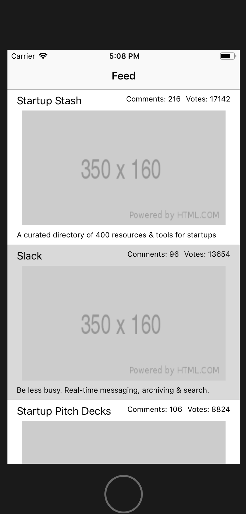
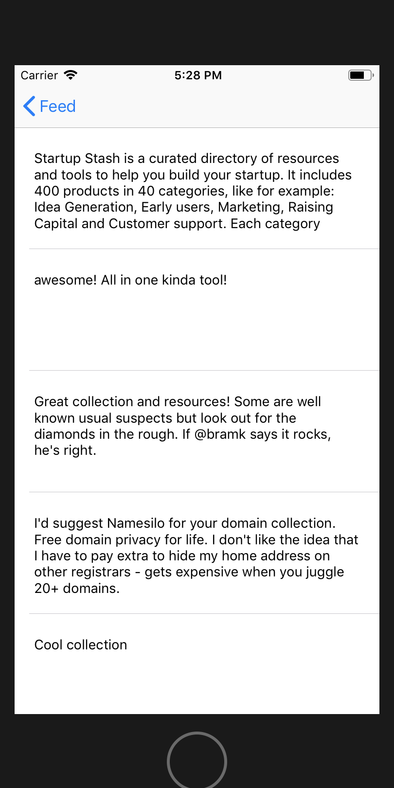

Now we have everything we need to have the full app working and ready to show to the client.

First let's update the `FeedViewController` to use the refactored networking methods.

# Update FeedViewController

> [action]
> Change `updateFeed` method to use new `getPosts` method.
>
```swift
func updateFeed() {
   networkManager.getPosts() { result in
       switch result {
       case let .success(posts):
         self.posts = posts
       case let .failure(error):
         print(error)
       }
   }
}
```

Instead of setting the `comments` list to mock data when pushing a `CommentsViewController` onto the `navigationController`, we'll send in the **id** of the post that was tapped.

> [action]
> Update the `tableView(tableView: didSelectRowAt:)` in our `FeedViewController.swift`
>
```swift
func tableView(_ tableView: UITableView, didSelectRowAt indexPath: IndexPath) {
   ...
   guard let commentsView = storyboard.instantiateViewController(withIdentifier: "commentsView") as? CommentsViewController else {
     return
   }
   // set the post id for the comments
   commentsView.postID = post.id
   navigationController?.pushViewController(commentsView, animated: true)
}
```

# Update CommentsViewController

> [action]
> Update `comments` to fill in its `didSet` method, add a `postID`, and add a `NetworkManager`. Be sure to update the comment var to an array of Comments and not an array of Strings:
>
```swift
class CommentsViewController: UIViewController {
 ...
>
var comments: [Comment] = [] {
    didSet {
        commentsTableView.reloadData()
    }
}
>
 var postID: Int!
>
 var networkManager = NetworkManager()
>
}
```
>
> Add a method to pull comments from `networkManager` called `updateComments`
>
```swift
func updateComments() {
   // Similar to what we did for posts
   networkManager.getComments(postID) { result in
       switch result {
       case let .success(comments):
         self.comments = comments
       case let .failure(error):
         print(error)
       }
   }
}
```
>
> Add the `updateComments()` method to the `CommentsViewController`'s `viewDidLoad()`
>
```swift
override func viewDidLoad() {
...
>
   updateComments()
}
```
>
> Update the `tableView(tableView: cellForRowAt:)` method to use the properties of our `Comment` model.
>
```swift
func tableView(_ tableView: UITableView, cellForRowAt indexPath: IndexPath) -> UITableViewCell {
   ...
>
   let comment = comments[indexPath.row]
   cell.commentTextView.text = comment.body
   return cell
}
```

# Product So Far

Done! Now you have a completed product ready to show the client 😄





Congratulations! As you go through this MOB course, see how you can relate what you've learned here to the material in class!

# Now Commit

```bash
$ git add .
$ git commit -m 'Completed PH Reader'
$ git push
```

# Feedback and Review - 2 minutes

**We promise this won't take longer than 2 minutes!**

Please take a moment to rate your understanding of learning outcomes from this tutorial, and how we can improve it via our [tutorial feedback form](https://goo.gl/forms/Lf2pJt1sjfJZF8VZ2)

# Stretch Challenges

If you're still hungry for more, here are some stretch challenges to improve upon your product:

>[challenge]
>
- We still don't have images being pulled into the app! Replace the `placeholder` image with the actual images of the products from the Product Hunt API
- Allow users to filter by `topics` (check out the `post` data from the Product Hunt API)
- For each product, show the `maker` of that product by displaying their name and picture underneath the product `tagline` (Product Hunt API `post` data can help you here too!)
